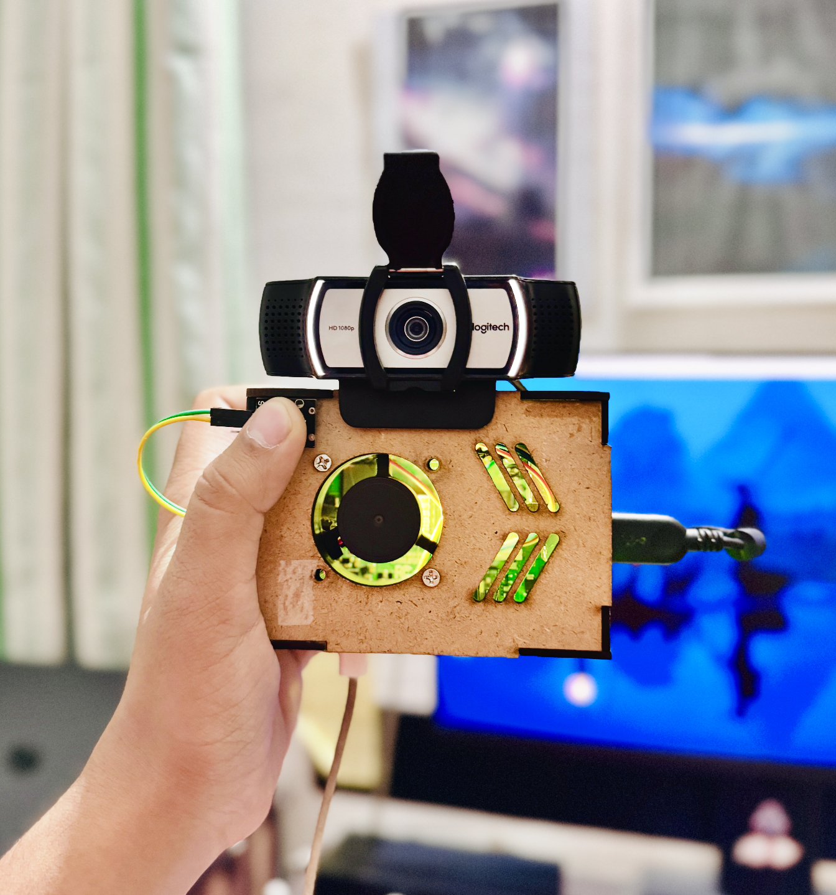

# 👁️ BlindSight – AI-Powered Accessibility Device for the Visually Impaired

<p align="center">
  
</p>

BlindSight is a wearable smart assistant built using Raspberry Pi that helps blind or visually impaired individuals navigate the world with confidence. It uses computer vision, depth estimation, and ultrasonic sensing to detect obstacles, identify objects, and provide real-time feedback through voice and vibration.

---

## 🔍 Features

- 🎯 **Real-time Object Detection**  
  Powered by YOLOv8 (custom-trained) to recognize people, doors, stairs, vehicles, and more.

- 🌐 **Depth Estimation from RGB**  
  Uses a deep learning model (ML-Depth-Pro) to estimate distances to objects without any depth camera.

- 🔊 **Text-to-Speech Feedback**  
  Describes what’s in front of the user or alerts when objects appear or change.

- 📍 **Navigation Support**  
  Offers walking directions to chosen destinations via voice guidance.

- 📸 **Camera-based Environment Awareness**  
  Detects new objects entering the scene and tracks what's currently in view.

- 🤖 **Ultrasonic Obstacle Detection**  
  Alerts the user using vibration motors if something is too close.

- 🔘 **Tactile Controls**  
  Physical buttons let users request object description or navigation assistance.

---

## 💡 How It Works

- A camera mounted on the wearable captures real-time frames.
- YOLOv8 and ML-Depth-Pro models analyze the scene on-device.
- Voice responses are generated using TTS to describe surroundings.
- Vibration motors provide haptic feedback when obstacles are close.
- Users can interact with the device using hardware buttons.

---

## 🛠 Tech Stack

- Raspberry Pi (any model with camera and GPIO support)
- Python 3.9+
- [Ultralytics YOLOv8](https://github.com/ultralytics/ultralytics)
- Custom-trained depth estimation model (ML-Depth-Pro)
- pyttsx3 for offline TTS
- OpenCV for video capture and preprocessing
- Ultrasonic sensor (HC-SR04)
- Vibration motors for haptic alerts
- Buttons (GPIO) for user interaction

---

## 🚀 Getting Started

1. Clone the repository:
   ```bash
   git clone https://github.com/yourusername/blindsight-device.git
   cd blindsight-device
2. (Optional) Create a virtual environment and install dependencies:

```bash
Copy
Edit
pip install -r requirements.txt
```

3. Download the required model weights and place them in the correct folders:

```checkpoints/depth_pro.pt```

```yolov8x.pt```

Run the main script:

```bash

python main.py
```

4. 📦 Folder Structure
```bash
Copy
Edit
.
├── device.png                # Preview image of the wearable
├── checkpoints/              # Folder for model weights
├── scripts/                  # Python scripts for inference, navigation, etc.
├── main.py                   # Main program
├── README.md                 # This file
├── requirements.txt          # Python dependencies
└── .gitignore
```

👨‍🔬 Author
Made with ❤️ by Aditya Tripathi (BENi-Aditya)

