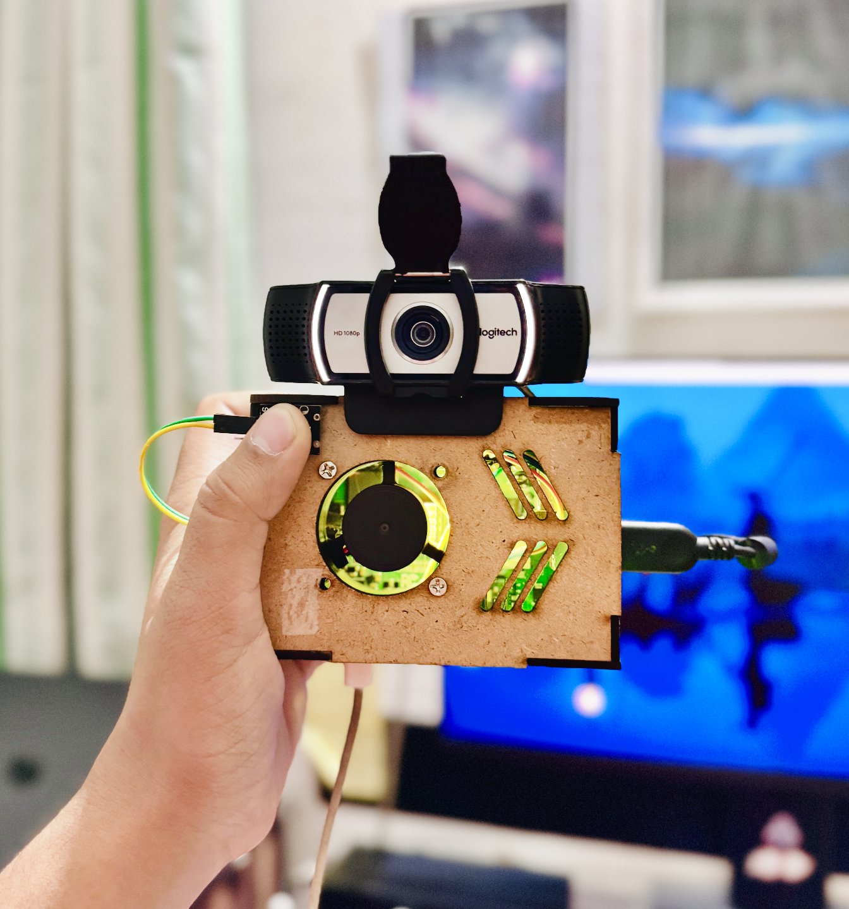

# BlindSight

A wearable smart assistant built on Raspberry Pi that helps visually impaired individuals navigate independently. Uses computer vision, depth estimation, and ultrasonic sensing for obstacle detection, object identification, and real-time voice feedback.

<p align="center">
  
</p>

---

## Features

- **Real-time Object Detection** — YOLOv8 (custom-trained) recognizes people, doors, stairs, vehicles, etc.
- **Depth Estimation** — ML-Depth-Pro estimates distances from a single RGB camera, no depth sensor needed.
- **Text-to-Speech** — Describes surroundings and alerts when objects appear or change.
- **Navigation** — Walking directions to chosen destinations via voice guidance.
- **Ultrasonic Obstacle Detection** — Vibration motors alert the user when something is too close.
- **Tactile Controls** — Physical buttons to request descriptions or navigation help.
- **AI Assistant** — Gemini API integration for scene description and Q&A about surroundings.

---

## How It Works

1. A camera mounted on the wearable captures real-time frames.
2. YOLOv8 and ML-Depth-Pro models analyze the scene.
3. Voice responses are generated using TTS to describe surroundings.
4. Vibration motors provide haptic feedback when obstacles are close.
5. Users interact with the device using hardware buttons or voice commands.

---

## Tech Stack

- Raspberry Pi 4B (8GB recommended)
- Python 3.9+
- [Ultralytics YOLOv8](https://github.com/ultralytics/ultralytics)
- [Apple ML-Depth-Pro](https://github.com/apple/ml-depth-pro)
- [Google Gemini API](https://aistudio.google.com/apikey) (for AI assistant)
- pyttsx3 (offline TTS)
- OpenCV
- HC-SR04 ultrasonic sensor
- Vibration motors, GPIO buttons

---

## Getting Started

Clone the repo:

```bash
git clone https://github.com/wigglevig/Accesibility-Device-Blind.git
cd Accesibility-Device-Blind
```

### Quick setup (Raspberry Pi)

```bash
chmod +x rpi_assistant/setup.sh
./rpi_assistant/setup.sh
```

### Manual setup

```bash
python3 -m venv venv
source venv/bin/activate
pip install -r rpi_assistant/requirements.txt
```

Download model weights:
- `yolov8n.pt` — auto-downloaded on first run
- `checkpoints/depth_pro.pt` — downloaded by setup script or manually from [HuggingFace](https://huggingface.co/apple/DepthPro)

Set up your Gemini API key:

```bash
cp .env.example .env
# edit .env and paste your key
```

Run:

```bash
python -m rpi_assistant.main
```

---

## Folder Structure

```
.
├── rpi_assistant/            # Main application (new, modular)
│   ├── main.py               # Entry point
│   ├── config.py             # Configuration
│   ├── audio_engine.py       # TTS + speech recognition
│   ├── button_handler.py     # GPIO / keyboard input
│   ├── camera.py             # Camera capture
│   ├── detector.py           # YOLOv8 object detection
│   ├── distance.py           # Ultrasonic sensor
│   ├── safety_monitor.py     # Background obstacle alerts
│   ├── ai_assistant.py       # Gemini API integration
│   ├── setup.sh              # One-command RPi setup
│   └── requirements.txt      # Python dependencies
├── building_final.py         # Original detection + depth script
├── navigation.py             # Walking directions
├── checkpoints/              # Model weights (gitignored)
├── runs/                     # YOLO training artifacts (gitignored)
├── .env.example              # API key template
└── README.md
```

---

## Author

wigglevig
